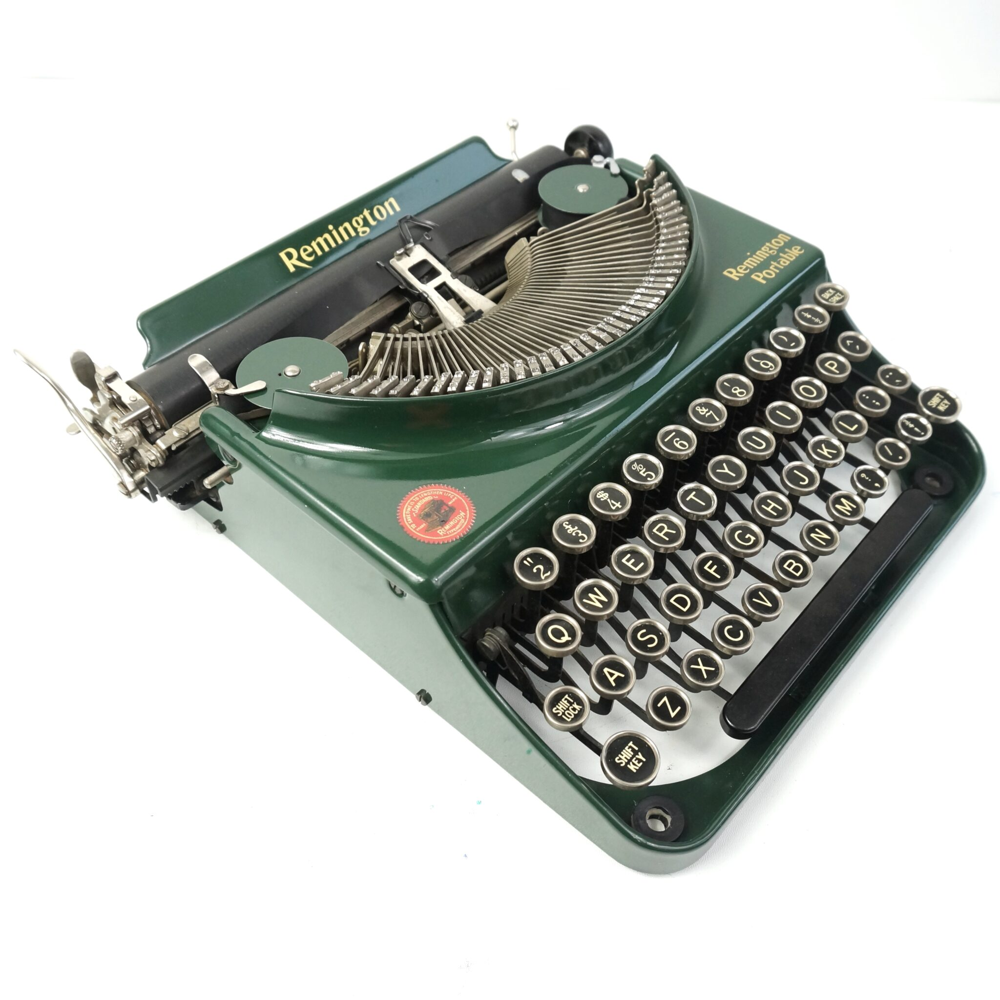

+++
title = 'crkbd: A Better Keyboard'
author = 'Oliver Jarvis'
date = 2024-08-29T15:14:01+01:00
draft = false
+++

## Introduction
I have been interested in mechanical keyboards for a few years now. And after a couple of years of using the [Keychron K14](https://www.keychron.com/pages/keychron-k14-wireless-mechanical-keyboard) I now wanted to start looking for something more custom.
I am always trying to improve my developer experience and workflow (see my [dotfiles](https://github.com/ollyjarvis/dotfiles)) (arch btw) so I went looking with a general idea to find something better than a standard keyboard.

## The Corne 42
The [crkbd](https://github.com/foostan/crkbd) is an Open-Source keyboard based on the [Helix](https://github.com/MakotoKurauchi/helix) with a 3x6 column staggered layout and 3 thumb keys. 

The benefits of a Corne over a more traditional keyboard are:
- **Column stagger** instead of row stagger. Row stagger exists on keyboards to match the layout of a typewriter where it allowed multiple rows stems to miss each other. This is not ideal though as my fingers at least like to move linearly and not laterally. The column stagger aims to better match the lengths of your fingers as to not cramp index fingers or over-stretch pinkies.

- **Thumb buttons**. Usually we are only pressing spacebar with two of our strongest fingers (is a thumb a finger), here we can put them to better use.
- **Repairability**. With access to a soldering iron it should last forever.
- **Flexibility**. With the also Open-Source [QMK Firmware](https://qmk.fm/) there are a lot of posibilities. I use only the layers (to reach the keys that don't fit) and OLED functions but there are many more. And if you can code then you can write your own.

## My Layout
[My QMK Fork](https://github.com/ollyjarvis/qmk_firmware_corne)
### Colemak Mod-DH
So, why not QWERTY? Well, if I am going to make such a drastic change, why not make it even harder than it needs to be?
QWERTY is bad, by every metric it **sucks**. But most basically it puts the most used keys in english wherever it likes.
#### QWERTY vs. Colemak Heatmap


I am actually using a modified [Colemak Mod-DH](https://colemakmods.github.io/mod-dh/) and a different keyboard than the image but this demonstrates the benefit on some english sample text.
### Layers
You might be thinking, fairly, "How do you fit all your keys onto 42 switches?". Well there are two techniques I use on my Corne, the first being layers.
You have likely experienced layers on your phone's keyboard where numbers and symbols are in a second layer. I have two layers (one activated by each thumb) for numbers and symbols separately. This allows all of my keys to be within reach at the home-row and is what allows keyboards so small to exist.
### Home-row Modifiers
The second is slightly more unusual. The modifier keys have some problems. 

```
Does your pinky ever get tired from holding Shift or Ctrl?

Do you find you fingers contorted trying to press Meta + Shift + 2?
```

Maybe not. But I do. For Hyprland (did I say arch btw), Copy + Paste etc. Home-row mods put your mods on your home-row simply by holding the key instead of a letter you get a modifier. Using QWERTY for simplicity.
| Left | Right | Modifier |
| --------------- | --------------- | --------------- |
| F | J | Shift |
| D | K | Ctrl |
| S | L | Meta |


## Conclusion
I am bad at typing on the Corne at the minute, barely able to get to 20 WPM currently (after 5 days), but I was bad on QWERTY (50 WPM) after over 10 years, I think that my new layout forcing me to touch type will mean I pass 50 WPM soon enough.
